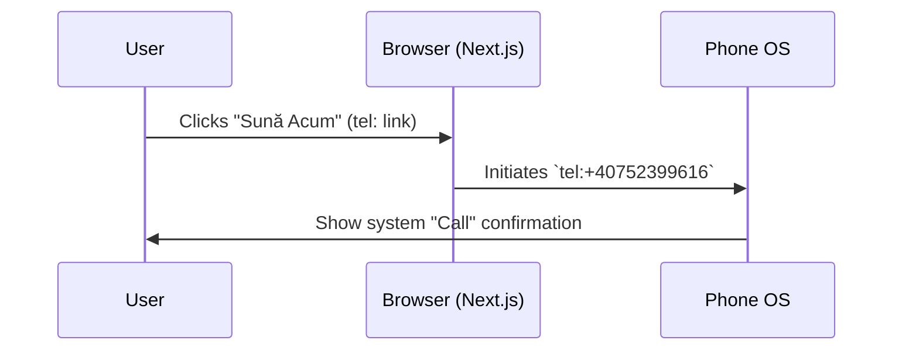
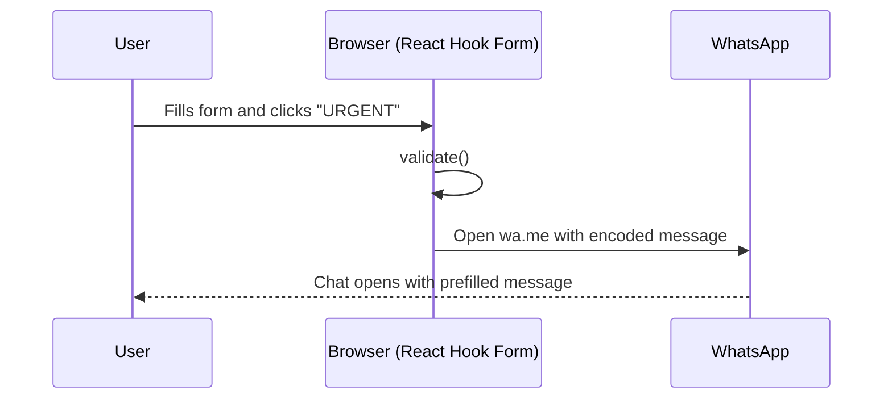

-----

# CONFORT INSTAL Fullstack Architecture Document

## Introduction

This document details the **SEO-focused, static, serverless architecture** for CONFORT INSTAL. It guides AI development for the Next.js/Tailwind SPA, ensuring performance, maintainability, and crucially, **high visibility in local searches for `instalator Iași`**.

**Starter Template or Existing Project**

  * N/A - Greenfield project. Initialize using `create-next-app`.

**Change Log**
| Date       | Version | Description                         | Author              |
| :--------- | :------ | :---------------------------------- | :------------------ |
| 2025-10-19 | 1.1     | Added detailed Technical SEO section | Winston (Architect) |
| 2025-10-19 | 1.0     | Initial architecture draft          | Winston (Architect) |

-----

## High Level Architecture

**Technical Summary**
The architecture is a **Statically Exported Next.js Application**, optimized for performance and **local SEO**. Built with React/TypeScript and Tailwind CSS, it pre-renders all content to static HTML. Contact is handled via **WhatsApp (wa.me)** and direct call links. The site is deployed globally via **Vercel**, leveraging its CDN and CI/CD. **Key technical SEO elements, including semantic HTML, optimized metadata, image optimization, and `LocalBusiness` JSON-LD schema, are integral to this architecture.**

**Platform and Infrastructure Choice**

  * **Platform:** Vercel (Hobby Plan).
  * **Key Services:** Vercel (Hosting, CI/CD, CDN), GitHub (Source control).
  * **Deployment Host:** Vercel Edge Network (Global).

**Repository Structure**

  * **Structure:** Single Repository. Standard Next.js structure.

**Architecture Diagram**

```mermaid
graph TD
    subgraph "User's Device (Browser)"
        A[User] --> B[site (Static HTML + JSON-LD)];
        B -- Clicks Call --> C[tel:+40752399616];
        B -- Clicks WhatsApp --> D[wa.me/40752399616];
    end

    subgraph "Vercel Edge Network"
        G[Static Site (HTML/CSS/JS)]
    end

    subgraph "External Services"
        J[Google Search Crawler]
    end

    subgraph "Recipient"
        I[Gmail (pascaldaniel1978@gmail.com)]
    end

    A -- Loads Site --> G;
    E -- Sends Form Data --> H;
    H -- Sends Email --> I;
    J -- Crawls & Indexes --> G;

```

**Architectural Patterns**

  * **Static Site Generation (SSG):** Using `output: 'export'` for maximum performance and SEO crawlability.
  * **Serverless:** No managed backend server.
  * **Component-Based UI:** Reusable React components rendering **semantic HTML**.
  * **Utility-First Styling:** Tailwind CSS.
  * **Client-Side API:** N/A (no email backend; WhatsApp/call only).
  * **Technical SEO:** Specific patterns for metadata, structured data, and content structure.

-----

## Tech Stack

**Technology Stack Table**
| Category           | Technology           | Version     | Purpose                            | Rationale                          |
| :----------------- | :------------------- | :---------- | :--------------------------------- | :--------------------------------- |
| Frontend Language  | TypeScript           | 5.x+        | Development language               | Type safety.                       |
| Frontend Framework | Next.js              | 14.x+       | App Router, static export          | Performance, SSG, SEO features.    |
| UI Component Lib.  | N/A (Custom)         | -           | -                                  | Custom Tailwind design.            |
| State Management   | Zustand              | 4.x         | "Emergency Mode" state             | Minimal global state.              |
| API Style          | N/A                  | -           | —                                  | —                                  |
| Form Handling      | React Hook Form      | 7.x+        | Form validation                    | Performance, simplicity.           |
| Form Emailing      | N/A                  | -           | —                                  | —                                  |
| Styling            | Tailwind CSS         | 3.x+        | UI/UX Styling                      | Utility-first, custom design.      |
| Deployment         | Vercel               | -           | Hosting, CI/CD, CDN                | Free, optimized for Next.js.       |
| Source Control     | Git / GitHub         | -           | Code repository                    | Standard, Vercel integration.      |
| Animations         | Framer Motion / AOS  | -           | Subtle UI animations               | Enhance "innovative" feel.         |
| **SEO Schema** | **`schema-dts`** | **latest** | **Type generation for JSON-LD** | **Ensures correct schema types.** |

-----

## Data Models

  * **`ContactFormData`** (TypeScript Interface): `{ name: string; phone: string; message: string; }`

-----

## Contact Mechanism

  * **WhatsApp:** Open `https://wa.me/40752399616?text=<encoded_message>` from the client after validation.

-----

## Core Workflows

**Workflow: Emergency Contact**



**Workflow: WhatsApp Contact via Form**



-----

## Technical SEO Implementation

This section details the critical technical SEO elements required.

**Metadata (Title & Description)**

  * **Implementation:** Use Next.js Metadata API in the root `app/layout.tsx`.
  * **Strategy:** Define a `metadata` object with static but **keyword-rich Romanian defaults**.
    ```typescript
    import type { Metadata } from 'next';

    export const metadata: Metadata = {
      title: 'CONFORT INSTAL - Instalator Autorizat Iași | Urgențe Non-Stop',
      description: 'Instalator sanitar și termic autorizat în Iași. Intervenții rapide pentru urgențe, reparații, montaj centrale. Seriozitate și Garanție. Sună Acum!',
      // Add other relevant metadata like openGraph, twitter cards if needed later
    };

    export default function RootLayout({ children }: { children: React.ReactNode }) {
      // ... rest of layout
    }
    ```

**Semantic HTML Structure**

  * **Requirement:** All components MUST use appropriate semantic HTML tags.
  * **Examples:**
      * Root `page.tsx` main content wrapper: `<main>`
      * Sections (Hero, Services, About...): `<section>`
      * Main page title (Hero Headline): `<h1>` (Only one per page)
      * Section titles (Services, About...): `<h2>`
      * Service card titles: `<h3>`
      * Navigation links: `<nav>`, `<ul>`, `<li>`, `<a>`
      * Footer address/contact: `<address>`
  * **Rationale:** Provides clear content structure for search engine crawlers.

**Image Optimization & SEO**

  * **Requirement:** All images MUST use the `next/image` component.
  * **Implementation:**
    ```typescript
    import Image from 'next/image';

    <Image
      src="/images/work/reparatie-teava-iasi.jpg" // Example path
      alt="Reparație țeavă spartă în baie - Instalator Iași CONFORT INSTAL" // Descriptive Romanian Alt Text
      width={500}
      height={300}
      // Add sizes for responsive loading if needed
    />
    ```
  * **`alt` Text:** Must be descriptive, in Romanian, and naturally include relevant keywords where appropriate.

**`LocalBusiness` JSON-LD Structured Data**

  * **Requirement:** Implement `LocalBusiness` schema (or `Plumber` subtype) using JSON-LD.
  * **Implementation:**
    1.  Create a dedicated component `app/components/SchemaOrg.tsx`.
    2.  Use the `schema-dts` library for type safety.
    3.  Generate the JSON object with accurate business details (provided by Daniel Pascal).
    4.  Include the script tag in the `<head>` via the root `layout.tsx`.
    <!-- end list -->
    ```typescript
    // app/components/SchemaOrg.tsx
    import Script from 'next/script';
    import { Plumber, WithContext } from 'schema-dts'; // Use Plumber subtype

    // Get accurate details from .env or config
    const ORG_NAME = "CONFORT INSTAL";
    const ORG_URL = "https://confort-instal.ro"; // Replace with actual domain later
    const ORG_LOGO = `${ORG_URL}/images/logo.png`; // Example path
    const ORG_PHONE = "+40752399616";
    const ORG_STREET = "Strada Exemplu Nr. 10"; // !! Replace with REAL Address
    const ORG_CITY = "Iași";
    const ORG_POSTAL = "700000"; // !! Replace with REAL Postal Code
    const ORG_COUNTRY = "RO";
    const ORG_LAT = 47.1585; // !! Replace with REAL Latitude
    const ORG_LON = 27.6014; // !! Replace with REAL Longitude

    const jsonLd: WithContext<Plumber> = {
      "@context": "https://schema.org",
      "@type": "Plumber",
      "name": ORG_NAME,
      "image": [ORG_LOGO],
      "@id": ORG_URL,
      "url": ORG_URL,
      "telephone": ORG_PHONE,
      "description": "Instalator sanitar și termic autorizat ANRE în Iași. Intervenții rapide pentru urgențe, reparații, montaj centrale.", // Keyword rich
      "address": {
        "@type": "PostalAddress",
        "streetAddress": ORG_STREET,
        "addressLocality": ORG_CITY,
        "postalCode": ORG_POSTAL,
        "addressCountry": ORG_COUNTRY
      },
      "geo": {
        "@type": "GeoCoordinates",
        "latitude": ORG_LAT,
        "longitude": ORG_LON
      },
      "openingHoursSpecification": [ // !! Replace with REAL Hours
        {
          "@type": "OpeningHoursSpecification",
          "dayOfWeek": ["Monday", "Tuesday", "Wednesday", "Thursday", "Friday"],
          "opens": "08:00",
          "closes": "18:00"
        },
         {
          "@type": "OpeningHoursSpecification",
          "dayOfWeek": ["Saturday"],
          "opens": "09:00",
          "closes": "14:00"
        }
        // Add Sunday if applicable, or specify non-stop if true
      ],
      "sameAs": [ // Optional: Add social media links if they exist
        // "https://www.facebook.com/confortinstal"
      ],
       "areaServed": { // Define service area
           "@type": "City",
           "name": "Iași"
       },
       // priceRange: "$$" // Optional: Add if desired
    };

    export function JsonLdSchema() {
      return (
        <Script
          id="jsonld-schema"
          type="application/ld+json"
          dangerouslySetInnerHTML={{ __html: JSON.stringify(jsonLd) }}
        />
      );
    }

    // Include <JsonLdSchema /> in app/layout.tsx within the <head> tag
    ```
  * **Validation:** Use Google's Rich Results Test and Schema Markup Validator.

-----

## Unified Project Structure

This is a standard Next.js 14 (App Router) structure. No monorepo is needed.

```plaintext
confortinstal/
├── .github/
│   └── workflows/
│       └── deploy.yml      # (Optional, Vercel auto-deploys)
├── .vscode/
│   └── settings.json       # (Tailwind intellisense)
├── app/
│   ├── components/         # Reusable components
│   │   ├── layout/
│   │   │   ├── Header.tsx
│   │   │   ├── Footer.tsx
│   │   │   └── SchemaOrg.tsx # Component for JSON-LD
│   │   ├── sections/
│   │   │   ├── Hero.tsx
│   │   │   ├── TrustBar.tsx
│   │   │   ├── Services.tsx
│   │   │   ├── About.tsx
│   │   │   ├── Portfolio.tsx
│   │   │   ├── FAQ.tsx
│   │   │   └── ContactForm.tsx
│   │   └── ui/             # "Dumb" UI elements (Button, Card, etc.)
│   │       ├── Button.tsx
│   │       └── Card.tsx
│   ├── hooks/              # Custom hooks (e.g., useEmergencyMode)
│   │   └── useEmergencyStore.ts # (Zustand store)
│   ├── lib/
│   │   └── types.ts        # (ContactFormData interface)
│   ├── layout.tsx          # Root layout (with Header, Footer, next/font, SchemaOrg)
│   ├── page.tsx            # The single, main page
│   └── globals.css         # Tailwind directives
├── public/
│   ├── images/
│   │   ├── logo.png        # Logo for Schema
│   │   ├── daniel-pascal.jpg
│   │   └── work/
│   │       ├── before-1.jpg
│   │       └── after-1.jpg
│   └── icons/
│       └── service-icon-1.svg
├── .env.local              # (Optional) No email secrets needed
├── .gitignore
├── next.config.mjs         # CRITICAL: output: 'export' will be set here
├── package.json
├── tailwind.config.ts
└── tsconfig.json

```

-----

## Development Workflow

**Local Development Setup**

1.  **Prerequisites:** `node.js` (v18+), `npm` or `yarn`.
2.  **Initial Setup:**
    ```bash
    git clone [repo-url]
    cd confortinstal
    npm install
    cp .env.example .env.local
    ```
3.  **Configure `.env.local`:**
    ```bash
    # No EmailJS keys required. Add business details if used for schema.
    ```
4.  **Development Commands:**
    ```bash
    # Run dev server
    npm run dev

    # Build for production (static)
    npm run build

    # Run tests (if any)
    npm run test
    ```

-----

## Deployment Architecture

**Deployment Strategy**

  * **Frontend/Backend Deployment (Unified):**
      * **Platform:** Vercel.
      * **Method:** Connect GitHub repository to Vercel project.
      * **CI/CD:** Vercel automatically builds and deploys on every `git push` to the `main` branch.
      * **Build Command:** `next build` (Vercel automatically detects `output: 'export'`).
      * **CDN/Edge:** All static assets are automatically served from Vercel's global edge network.

-----

## Security and Performance

**Security Requirements**

  * **Frontend Security:**
      * No user data stored.
      * Contact form: Client-side validation before opening WhatsApp.
  * **Secrets Management:** No email secrets required.

**Performance Optimization**

  * **Frontend Performance:**
      * **SSG:** `output: 'export'` for static HTML.
      * **Image Optimization:** Mandatory `next/image` for all images.
      * **Font Optimization:** Mandatory `next/font`.
      * **Bundle Size:** Keep client JS minimal.

-----

## Testing Strategy

  * **Manual Testing (CRITICAL):**
    1.  Verify `tel:` and `wa.me:` links (iOS, Android).
    2.  Test contact form submission -\> email receipt (check spam).
    3.  Test "Emergency Mode" toggle.
    4.  Verify responsiveness (mobile, tablet, desktop).
    5.  **Validate JSON-LD schema** using Google Rich Results Test & Schema Markup Validator.
  * **E2E Testing (Optional - Phase 2):** Cypress/Playwright can automate manual tests.

-----

## Coding Standards

**Critical Fullstack Rules**

  * **`output: 'export'`:** Mandatory in `next.config.mjs`.
  * **No Server-Side Code:** Use only client components (`"use client"`) where necessary (form, emergency toggle).
  * **Use `<Image>`:** Mandatory for all images. Provide **descriptive Romanian `alt` text**.
  * **Use `<Link>`:** For all navigation (scroll links).
  * **Semantic HTML:** Use `<h1>`, `<h2>`, `<section>`, `<nav>`, etc. correctly.
  * **State:** Use Zustand/Context only for Emergency Mode.
  * **Design:** Adhere strictly to Tailwind utility-first, symmetrical grid design.

-----

## Error Handling Strategy

  * **Contact Form:** Validate inputs, then open WhatsApp with an encoded message.

-----

## Checklist Results Report

  * This SEO-enhanced architecture is validated and ready. It provides a clear plan for building a fast, secure, and highly discoverable static website optimized for local Romanian searches (`instalator Iași`).

-----

